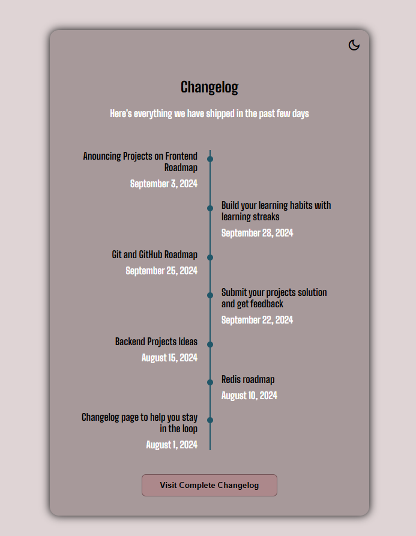

  <h1 align="center">
    Changelog component
  </h1>

 

# Objective
Create a simple Changelog component using CSS to style it and  add responsive features.
  

# README
https://roadmap.sh/projects/changelog-component
 
 

# PREVIEW

# EXTRA FEATURES
Add support for dark mode using CSS variables and javascript (same implementation as past projects).
 
 

# Auxiliary Resources
<ol>
  <li>
    <a href="https://www.alura.com.br/artigos/css-seletores-avancados-aplicacoes-web" alt="CSS: seletores avançados que facilitam o desenvolvimento de aplicações web">https://www.alura.com.br/artigos/css-seletores-avancados-aplicacoes-web</a>
     
    An article talking about many advanced features of CSS, used to get a better understanding of ":before" pseudo classes to add the time line to the changelog.
  </li>
   
  <li>
    <a href="https://www.w3schools.com/cssref/sel_before.php" alt="W3Schools - CSS ::before Pseudo-element">CSS ::before Pseudo-element</a>
     
    W3Schools reference for ":before" pseudo-element.
  </li>
   
  <li>
    <a href="https://coolors.co/" alt="coolors.co">coolors.co</a>
     
    Color palette generator to get color HEX and standardize their representation in the CSS.
  </li>
   
</ol>
